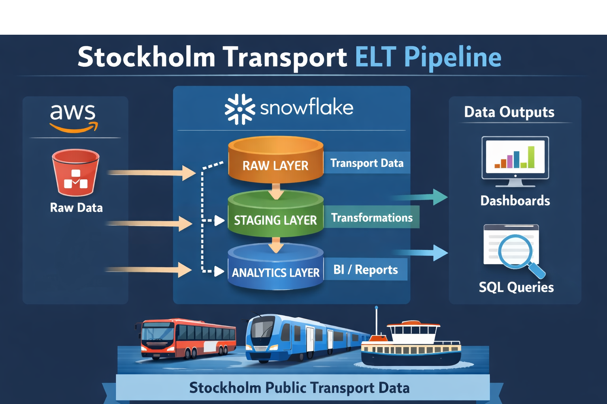
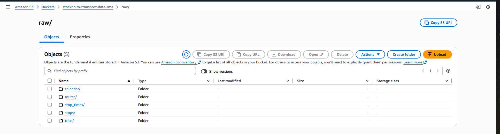
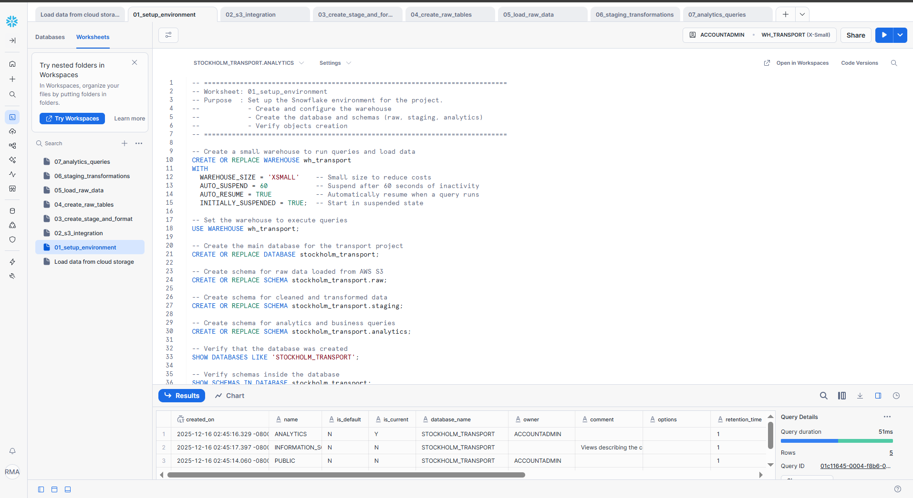
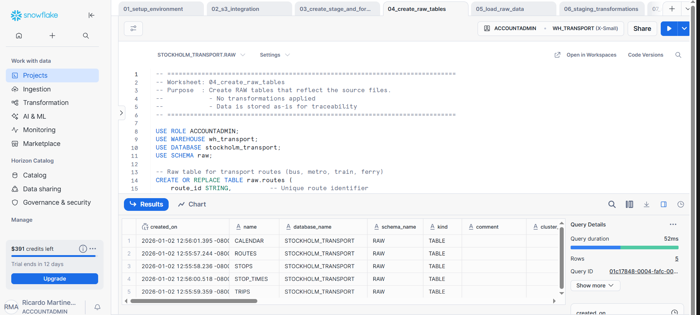
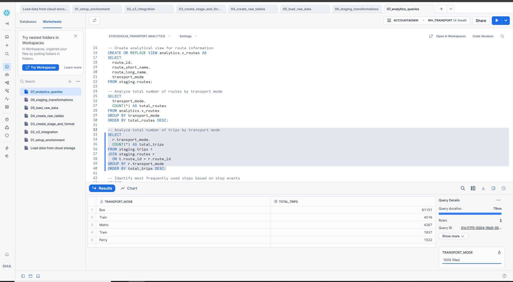

# Stockholm Transport ELT Pipeline (AWS S3 + Snowflake)

## Overview

This project demonstrates an end-to-end ELT data pipeline using public transport data from Stockholm.
Raw files are stored in AWS S3, loaded into Snowflake, transformed into clean tables, and analyzed through analytical queries.

The **purpose** of this project is to showcase practical Data Engineering skills using Snowflake and AWS with a clear architecture.

---

## Project Architecture
The pipeline follows a classic ELT approach:

- The **datasets** were downloaded from the following source: https://mobilitydatabase.org/feeds/gtfs/mdb-1320
- Files are uploaded to **AWS S3** (raw files)  
- **Snowflake RAW** layer stores original data (COPY INTO)  
- **Snowflake STAGING** layer (cleaned tables)  
- **Snowflake ANALYTICS** layer (analysis queries)
---

## Architecture Overview

---

## Data Description 
The dataset follows the GTFS (General Transit Feed Specification) format and includes:

- Routes
- Stops
- Trips
- Stop times
- Service calendar

This type of data is commonly used in real-world public transportation systems.

- **Service Date Range**
- Start: Feb 21, 2020
- End: Dec 13, 2020
- Days: 296

---

## Technologies Used
- AWS S3
- Snowflake
- SQL

---

## Snowflake Scripts Description

### **01_setup_environment**  
**Set up** the Snowflake environment for the project.
- Create and configure the warehouse
- Create the database and schemas (raw, staging, analytics)

### **02_s3_integration**  
Configure ***secure access** between Snowflake and AWS S3.
- Create the storage integration
- Retrieve IAM user ARN and external ID for AWS trust policy
- Enable Snowflake to assume an AWS IAM role

### **03_staging_transform.sql**  
Define how Snowflake **reads data** from S3.
- Create CSV file format
- Create external stage pointing to S3 raw data
- Validate access to S3 using LIST command

### **04_create_raw_tables**  
**Create RAW tables** that reflect the source files.
- No transformations applied
- Data is stored as-is for traceability

### **05_load_raw_data**  
**Load raw data** from AWS S3 into Snowflake RAW tables.
- Use COPY INTO from external stage
- Validate row counts after load

### **06_staging_transformations**  
**Clean, normalize, and enrich** raw data.
- Apply basic data quality filters
- Map route types to business-friendly transport modes
- Prepare data for analytics

### **07_analytics_queriess**  
Perform analytical queries and **generate insights**.

---

## Example Analytics Questions

- How many trips are scheduled for each route?
- How many distinct stops does each route serve?
- Which stops appear most frequently in the schedule?
- On average, how many stops does a trip have for each route?
- What is the service validity range (start/end) for each route?

---

## Pipeline Walkthrough (Evidence)

### AWS S3 Raw Data Structure

### Snowflake Database and Schema Structure

### Snowflake Staging Tables

### Analytical Queries Example

---

## How to Run
Execute the Snowflake scripts in the following order:

1. `snowflake/01_setup_environment`
2. `snowflake/02_s3_integration`
3. `snowflake/03_staging_transform.sql`
4. `snowflake/04_create_raw_tables`
5. `snowflake/05_load_raw_data`
6. `snowflake/06_staging_transformations`

---

### Why This Project Matters

This project demonstrates:

- A basic understanding of ELT data warehouse layering (RAW → STAGING → ANALYTICS).
- Practical experience loading and transforming real-world public transport data.
- Use of simple SQL joins to analyze routes, trips, and stops.
- Application of basic data cleaning and validation steps.
- Conversion of raw schedule data into clear, analytics-ready tables.

---

## Author
**Ricardo Martinez**
- Data Engineer | AWS | ELT | Snowflake
