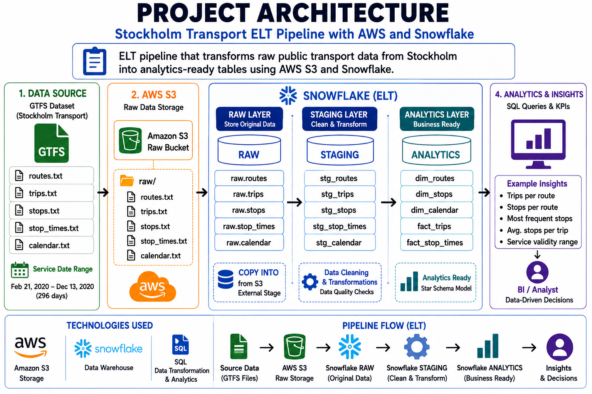
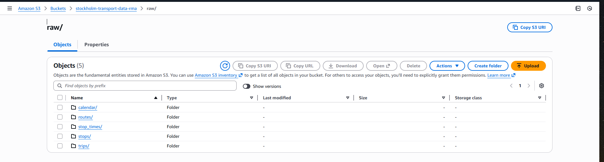
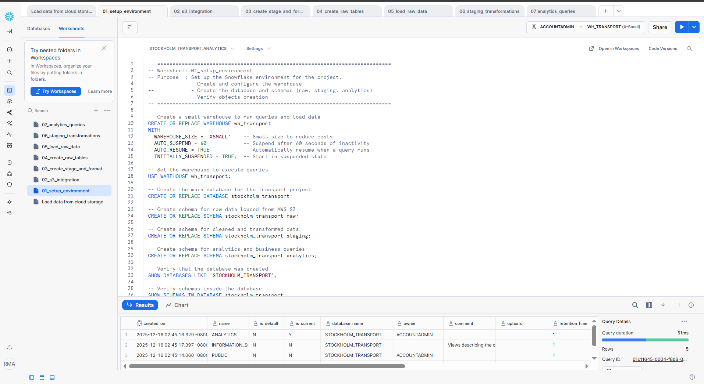
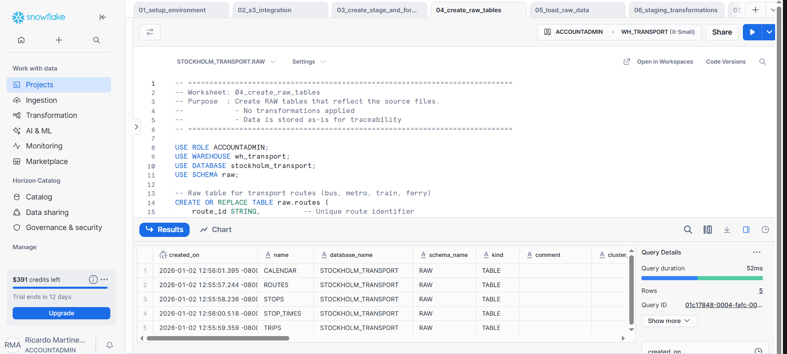
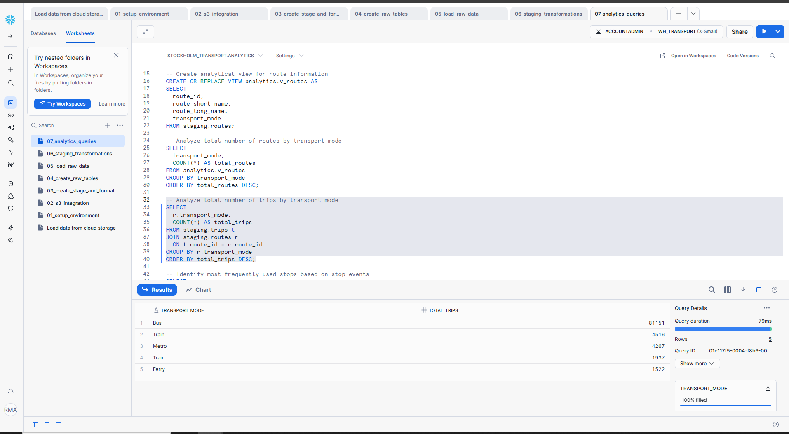

# Stockholm Transport ELT Pipeline (AWS S3 + Snowflake)

## 📌 Project Overview
 
This project demonstrates an end-to-end **ELT data pipeline** using real public transport data from Stockholm.
 
Raw files are stored in AWS S3, loaded into Snowflake, transformed into clean tables, and analyzed through analytical SQL queries.
 
The purpose of this project is to showcase practical Data Engineering skills using **Snowflake and AWS** with a clear, layered architecture.

---

## Project Architecture

The pipeline follows a classic **ELT** approach:

- Files are uploaded to **AWS S3** (raw files)
- **Snowflake RAW** layer stores original data (`COPY INTO`)
- **Snowflake STAGING** layer holds cleaned tables
- **Snowflake ANALYTICS** layer supports analysis queries

---

## 🛠 Technologies Used
 
| Technology | Purpose                                          |
| ---------- | ------------------------------------------------- |
| AWS S3     | Raw data storage (Data Lake landing zone)          |
| Snowflake  | Cloud data warehouse (RAW / STAGING / ANALYTICS)   |
| SQL        | Data transformation and analytical querying        |
| IAM        | Secure integration between AWS S3 and Snowflake    |
 
---

## 📂 Data Description 
The dataset follows the **GTFS (General Transit Feed Specification)** format and includes:

- Routes
- Stops
- Trips
- Stop times
- Service calendar

This type of data is commonly used in real-world public transportation systems.

- **Service Date Range:** Feb 21, 2020 – Dec 13, 2020 (296 days)

---

## 🔄 Snowflake Pipeline Steps
 
### 1️⃣ Setup Environment
Create and configure the Snowflake warehouse, database, and schemas (`raw`, `staging`, `analytics`).
 
### 2️⃣ S3 Integration
Configure secure access between Snowflake and AWS S3: create the storage integration, retrieve the IAM user ARN/external ID, and enable Snowflake to assume the AWS IAM role.
 
### 3️⃣ Staging Transform Setup
Define how Snowflake reads data from S3: create the CSV file format, the external stage pointing to S3, and validate access with `LIST`.
 
### 4️⃣ Create RAW Tables
Create RAW tables that reflect the source files exactly, with no transformations, preserving traceability.
 
### 5️⃣ Load Raw Data
Load raw data from AWS S3 into Snowflake RAW tables using `COPY INTO`, validating row counts after load.
 
### 6️⃣ Staging Transformations
Clean, normalize, and enrich raw data: apply data quality filters, map route types to business-friendly transport modes, and prepare data for analytics.
 
### 7️⃣ Analytics Queries
Run analytical queries on the STAGING layer to generate business insights.

---

## 📊 Example Analytics Questions

- How many trips are scheduled for each route?
- How many distinct stops does each route serve?
- Which stops appear most frequently in the schedule?
- On average, how many stops does a trip have for each route?
- What is the service validity range (start/end) for each route?

---

## 📸 Pipeline Walkthrough (Evidence)

### AWS S3 Raw Data Structure

### Snowflake Database and Schema Structure

### Snowflake Staging Tables

### Analytical Queries Example

---

## ⚙️ How to Run
Execute the Snowflake scripts in the following order:

1. `snowflake/01_setup_environment`
2. `snowflake/02_s3_integration`
3. `snowflake/03_staging_transform.sql`
4. `snowflake/04_create_raw_tables`
5. `snowflake/05_load_raw_data`
6. `snowflake/06_staging_transformations`
7. `snowflake/07_analytics_queriess`

---

## 🎯 Key Features
 
- Built an end-to-end ELT pipeline across AWS S3 and Snowflake.
- Implemented a layered data warehouse architecture (RAW → STAGING → ANALYTICS).
- Configured secure cross-cloud integration between AWS and Snowflake using IAM.
- Processed real-world GTFS public transportation data.
- Wrote analytical SQL queries to answer real business questions about transit service.

---

## 📚 Skills Demonstrated
 
- Data Engineering
- Snowflake (RAW/STAGING/ANALYTICS architecture)
- AWS S3 & IAM
- ELT Pipelines
- SQL Data Cleaning & Transformation
- Data Warehouse Layering

---
 
## 💡 Lessons Learned
 
- Setting up secure storage integrations between cloud providers (AWS ↔ Snowflake) requires careful IAM trust configuration.
- Working with real-world GTFS data highlighted the importance of data quality checks before analysis.
- Structuring a warehouse into RAW/STAGING/ANALYTICS layers keeps raw data traceable while enabling clean, reliable analytics.

---

## 👤 Author

**Ricardo Martinez**

Data Engineer | AWS | ELT | Snowflake
